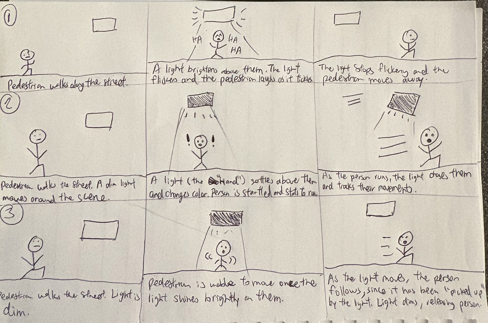
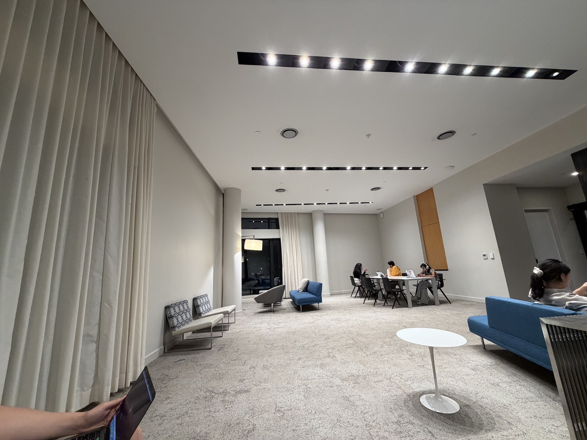
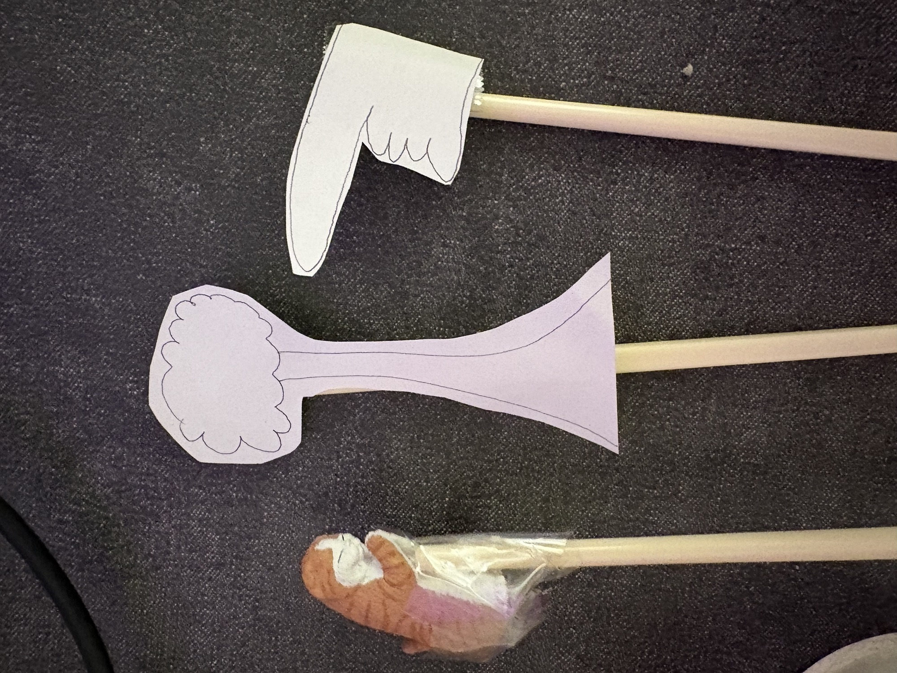
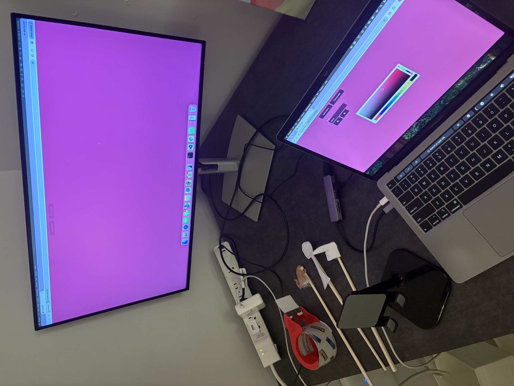
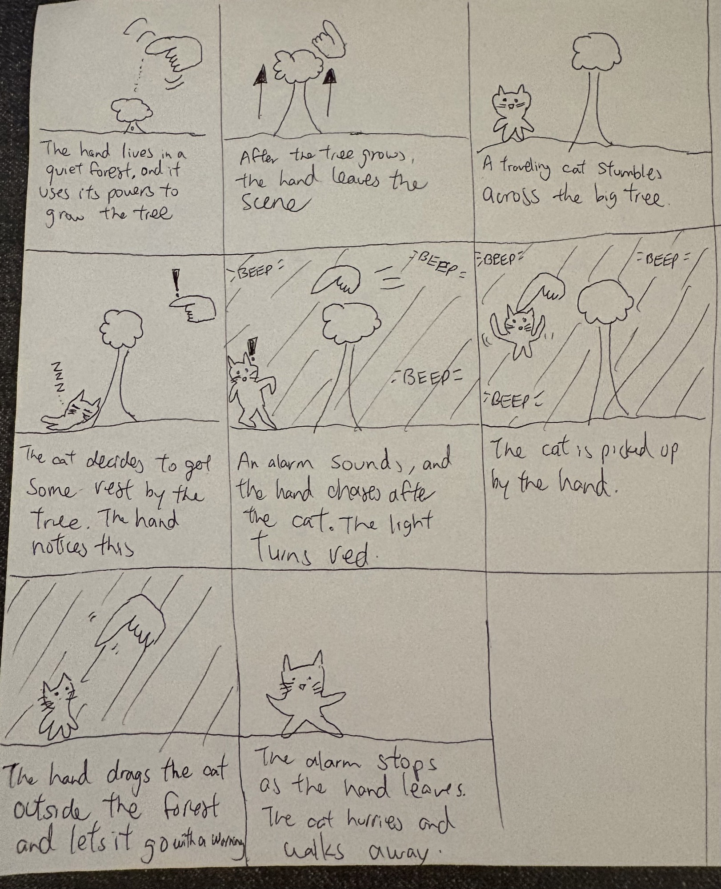

# Recreating the Masters of Interactive Light

_This project is to be done in teams of 2._

**NAME OF BOTH COLLABORATOR(S) HERE**

Edmond Kong (eck67)

**THE MASTERWORK YOU DREW FROM THE HAT:**

Hand from Above (2009)
---

One way to understand greatness is to look to the greats. Just as painters learn
the technique and artistry of the old masters by recreating their paintings, so
too shall we come to understand computer-mediated interaction by recreating the
interactive masterworks of our time.

This week, every team will draw a different masterwork from a hat. Some are
conceptual pieces, some are historical works, some are modern-day products —
but they all share one thing: **their central mode of interaction is carried by
light.** Think of Tinker Bell in the original stage production of *Peter Pan*,
represented by nothing more than a darting circle of light from an off-stage
mirror. There was no actor playing Tinker Bell; she existed entirely through the
way the other characters interacted with that light.

Your job is to recreate the *interaction* of the piece you drew — not to build a
museum-grade replica, but to stage the moment that makes it what it is. Someone
who knows your piece should watch your recreation and recognize it instantly.
Someone who has never heard of it should walk away understanding what it is
famous for.

You will do this using the interaction staging techniques we will use all semester: a
storyboard, some acting, a phone standing in as a controllable light (the
*Tinkerbelle* tool), a hidden human "wizard" driving it, a costume, and a
recorded video.

*Make sure you read all the instructions and understand the whole activity
before starting!*

## Prep

To start, you will need:

1. Read about Git [here](https://git-scm.com/book/en/v2/Getting-Started-What-is-Git%3F).
2. Set up your own Github "Lab Hub" by forking the [Interactive-Lab-Hub repository](https://github.com/IRL-CT/Interactive-Lab-Hub). To get lab updates, simply use [GitHub's "Sync fork" button](https://docs.github.com/en/pull-requests/collaborating-with-pull-requests/working-with-forks/syncing-a-fork) when new content is available.

3. Set up your `README.md` so it has your name and links to this lab. Learn to
   format a README [here](https://docs.github.com/en/get-started/writing-on-github/getting-started-with-writing-and-formatting-on-github/basic-writing-and-formatting-syntax).
4. **Draw your masterwork from the hat and write it at the top of this file.**
   Whatever you drew is yours — lean into it.

## Materials

For this lab you will need:

1. Paper, markers/pens, scissors
2. A smartphone with a browser that can display a webpage (your stand-in "light")
3. A computer to host the control webpage
4. Found objects and materials to **costume your phone so it looks like the
   device in your masterwork** — doll clothes, a paper lantern, a bottle, foil,
   a cardboard shell, whatever it takes. Be resourceful.

## Deliverables

Submit all of the following in this lab folder of your Lab Hub, as links or
uploaded files. **Each group member posts their own copy to their own Github repo**, even if the work is
shared.

1. A short **research write-up** of your masterwork (what it is, when, who made
   it, and — most importantly — what the interaction is)
2. **3 iterated storyboards** of the interaction in the masterwork
5. A **video sketch** of your prototyped interaction
6. Any **reflections** on the process

Labs are due on Mondays. Make sure this page is linked from your main class hub
page.

---

# The Report

## Part 0. Know Your Master

Before you prototype anything, get intimately acquainted with the piece you
drew. Do real research. You are looking less for trivia than for the *shape of
the interaction*:

- What inputs are available to the user? What responses does the work give?
- Who is present, and how does the piece color the relationships between them?
- What is the piece famous for? What are its strengths and its weaknesses?

  Sometimes the details of how the interaction worked are lost in history. Try filling it in with your imagination!

**Describe your masterwork here, in your own words. What is the core interaction
someone would recognize it by?**

The Hand from Above project was created by Chris O'Shea in 2009. This was a public exhibition where a camera captured live video of the street below
a giant screen. So as pedestrians walked into the range of the camera, the screen would also show the pedestrians in real time. The screen would have a giant hand that would interact with the pedestrians in different ways, such as tickling, miniaturizing, and picking up people to move them off-screen.

User input is their movement in the camera frame. As they walk into the frame they become part of the display and are now able to be manipulated by the giant hand. The hand is able to perform actions on the people it detects. One of the ideas for this project was to make people look like they weren't "on top of the food chain", so people don't really get to choose the hand's actions and appear powerless in front of it. Users can just watch and react to the hand as it toys with them.

Since this installment was shown back in 2009 and based on the audience reactions from the videos I could find, I imagine it was an early example of an interactive screen that could make people feel like they are controlled by an external force. The most memorable interaction is where the hand picks up a person and drags them out of the screen. Even if the person is physically standing in the frame, we wouldn't see the person in the screen afterwards.

The strength is the surprise factor of the giant hand. When the hand just moves around the screen and tickles a person, this is just a regular computer vision trick. But when the hand picks someone up and the person disappears from the screen, people are very surprised. This is also one of the weaknesses of the exhibit: people can only be surprised once after they know what's coming next. Another weakness is that the interactions are restricted by a fixed point in space. The hand can only interact with people that stand in the camera's frame.

## Part A. Plan

For your masterwork, reconstruct the interaction as a scene:

- **Setting:** Where and when does this interaction happen? The interaction takes place on the street. For this lab, we chose to do it inside a room to better see the light.
- **Players:** Who is involved? Who else is present? A pedestrian, a hidden wizard operating the light, and the audience, who will be looking at the interaction
- **Activity:** What is happening between the players and the light? As the pedestrian moves into the range, i.e the camera frame, of the light, the light will perform certain actions depending on the intensity of the light and flickering.
- **Goals:** What is each player trying to do? The player just trying to cross to the other side of the street, but it encounters the light, or the Hand, and is then forced to interact with it. The audience wants to understand what the light actually does.

Now **sketch a 3 storyboards** of the interaction you are recreating. (The number may depend on the thing you drew, but stretch your thinking!) They
don't need to be beautiful, but they must capture and communicate not only the behavior of the light, but how it affects
and the people around it. If you're new to storyboarding, read
[this explanation](https://www.nngroup.com/articles/storyboards-visualize-ideas/).

**Include pictures of your storyboards here.**

The three storyboards are included above. Interaction #3 will be the one that's acted out in Part B.

**Summarize the feedback you got here.**
The collaborators for my lab mentioned that the light interaction was a little difficult to follow. So we discussed ideas on how to make the light more visible. We settled on having a darker color to symbolize the light was "on". So instead of a light color we used dark magenta.

## Part B. Act out the Interaction

Physically act out the interaction you planned. For now, just pretend the light
is doing what you've scripted — a person can wave a flashlight, or you can narrate
it aloud.

**Are there things that seemed better on paper than when acted out?**
The intensity of the light is difficult to capture in video. The original work had a giant hand, but it is challenging to
replicate this with just a light. It is also difficult to have a hand "over" the light since it will block the light. 

**Did new ideas about the piece surface once you were on your feet?**
One idea was to have a large paper cutout of a hand, which would then be illuminated by the phone behind it. That way, we
still have an image of a hand but light can be present in the interaction. A limitation that we have when acting this out is 
that we don't have a giant LED screen like the original masterwork. So instead, the frame of the video will be the area in which
the light can interact with a person.

**Are there key moments in the interaction where things could go in a different direction?**
The audience may be confused about the relationship between the light and the pedestrian. Without narration of the events that go on, the audience won't know that it is the light that is controlling the person. 
When the light turns a different color, anything could happen because we don't know what if the color itself is significant other than indicating that something has changed. For example, what if the light is
bright yellow instead of magenta?

## Part C. Prototype the Light (light first!)

Use your smartphone as the light of your device. Open the browser on your phone
to act as the "light," and use the remote control interface on your computer to
change that light. Code and setup instructions for the *Tinkerbelle* tool are
[here](https://github.com/IRL-CT/tinkerbelle) (we invented this tool for
this lab). If you hit technical trouble, a manually or remotely controlled light
switch, dimmer, or lamp is a fine substitute.

**Get the light interaction working before anything else.** Your grade this week
rides on the *light* being recognizable — the color, the rhythm, the timing, the
way it answers a person. Only once your light interaction genuinely reads as your
masterwork should you consider layering in a second modality (sound, vibration,
motion). If in doubt, keep polishing the light. The other modalities are next
week's business.

## Part D. Wizard the Device

Set up a "wizard" arrangement so one person can secretly drive the light while
another acts with it — this is how you make the device feel alive without
building any real electronics. (Zoom works well for recording; you can pin the
video feed of whichever scene you want to capture.)

**Include your first attempts at recording the wizarded set-up here.**

This is the scene for the initial filming.

## Part E. (optional) Costume the Device

Only now should you worry about what the device looks like. Costume your phone so it reads
as the object from your masterwork — HAL's eye, a Simon shell, a paper-lantern
Tinker Bell, an Ambient Orb, a lighthouse, a jack-o'-lantern, whatever you drew.

Think about the world your device lives in: could that environment overheat it?
Is water a danger? Does it need to be loud and bright for an emergency, or quiet
and calm for a bedroom?

**Include sketches/photos of what your device might look like here.**
The phone can be costumed with a cutout of a hand, similar to the one in the original work. 

**What concerns or opportunities shaped the way you designed its look?**
The cutout of the hand will be static, so it still won't be able to do dynamic movements such as pinching
or waving which we can see in the video.

## Part F. Record

**Record your prototyped interaction as a video sketch.** Aim for the bar from
the top of this lab: a viewer who knows the piece should recognize it; a viewer
who doesn't should come away understanding what it's famous for. How might you illustrate the non-sequential aspects of the interaction in the sketch?

**Include your video here.**

https://github.com/edmkong/Interactive-Lab-Hub/raw/Fall2026/Lab%201/video.mp4

**Please indicate who you collaborated with on this lab.** 
Melody Huang (yh2353), as the wizard holding the light.
Jacey Hu (ch2296), as the actor in the sketch.

---

# Part 2 — ReMastering the light

*This describes the second week's work for this lab activity.*

## Prep (before the next lab)

Find three other groups. (How? Maybe Slack?) Visit their Lab Hub pages, watch their
videos, and give them reactions and feedback: tell them what you saw happening,
guess the masterwork and the goals of the characters, and ask about anything that
wasn't clear.

**Who were the other groups you kibitzed with? Add links to their project pages here.**
**Summarize the feedback you got from your partners here.**

Feedback 1: Dhanu
Github link: http://github.com/rdhanushikka/Interactive-Lab-Hub/tree/Fall2026/Lab%201 
Reviewer commented that the video with the side-by-side Tinkerbelle and interaction was nice. One criticism is that the third storyboard wasn't too clear in depicting the interaction. Specifically, it isn't clear that the user is "trapped" by the light once the light is shining above them, and it is the light that now "controls" the person. Only after watching the video was the interaction clear.

Feedback 2: Jacey
Github link: https://github.com/ht534-ui/Interactive-Lab-Hub 
The reviewer liked how the light and person moved together, which made the sequence easy to follow. One suggestion for the third storyboard is that in the third panel the light isn't lit up, so they were confused when they read the caption underneath. It took them a moment to realize that the person could actually move after the light was off. However, when they saw the video it was clear to them.

Feedback 3: Xiaoxi Xu 
Github link: https://github.com/xuxx21/Interactive-Lab-Hub/tree/Fall2026/Lab%201 
The reviewer mentioned how I can play around with the intensity of the light to demonstrate more interactions. The dragging is only side by side, but if I can move forwards and backwards that would show the control a little better. 

## Remix, Update, or Critique the Master

Now that you understand your masterwork from the inside, respond to it. Do the
recreation again, but this time make it your own — pick one of these moves (or
combine them):

1. **Remix the modality.** Your recreation no longer has to (just) use light. Use
   vibration, sound, motion, heat — whatever best carries the interaction. Feel
   free to fork and modify the Tinkerbelle code. (Add your updates to this lab's folder!)
2. **Update it.** Redesign the piece for today's context, or for a setting its
   creators never imagined (the piece with roommates in the room, with children
   present, on a phone, in a car).
3. **Fix its weaknesses.** You identified this master's strengths and weaknesses
   in Part 0 — now address a weakness, or push a strength further.

We will grade this second pass with an emphasis on **creativity** and on how well
your response engages with what your master was really doing.

**Document everything here — especially the storyboard and video. Photos of the
prototype are great too.**

One of the main weaknesses of the first attempts was that the portrayal of light as a controlling force is a little ambiguous. The audience won't know that
the purpose of the light is at first. So instead of using light as a control object I wanted to instead
use light to represent the mood of a scene and the the emotional state of the god-like hand. I made a cutout of a hand and introduced some other props in this next remix: 
a tree and a small cat figurine which will be the main actor in the video. 

The light is now just the backdrop. A phone will be facing the large monitor and recording as the set pieces (god hand, cat, tree) move in front of it. The wizard will be holding the 
props, which are taped to chopsticks, and will also be playing audio from Tinkerbelle. With this setup, the behavior of the hand is communicated through audio, color, and movement.

One of the weaknesses of the original masterwork was that it is limited to one frame (a giant LED screen), so for this remix I wanted to give the sense that the range of control
of the hand goes beyond one area. The concept is that this is a "god-like" hand that is protective of its environment. In this case, the environment it is guarding is a forest with a tree. 

The video starts of with the hand using its powers to grow the tree. The backdrop is green to represent peacefulness. A cat then walks into the forest and starts sleeping under the big tree.
The hand is not happy with this and starts to chase the cat. During the chase, the wizard changes the backdrop to red and also plays an alarm sound. The hand eventually picks up the cat
and drags it outside of the forest. As the hand leaves, the backdrop changes again to green. Finally the cat leaves.

https://github.com/edmkong/Interactive-Lab-Hub/raw/Fall2026/Lab%201/remix.mp4

---

The remixed video was created by myself. Since I did not have a partner for this lab I was not able to get actors for the video above.

*Assignment lineage: this lab merges "Staging Interaction" (Interactive Lab Hub)
with "Recreating the Masters" (Interaction Design Studio, Profs. Scott Minneman &
Wendy Ju). Massive list of interactive light masterworks generated by Claude.ai.*
